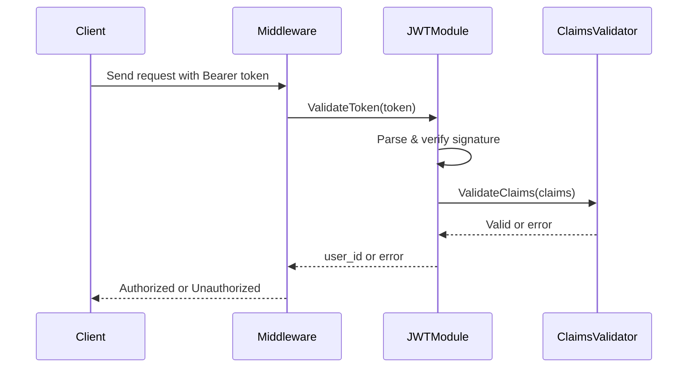

# JWT Validation Module

## Overview

This module implements robust JWT validation for server-side
authentication, including signature verification, claim validation, and
structured error handling. It is designed for production environments
and adheres to common security best practices.

## Features

- Signature validation using shared-secret HMAC.
- Validation of standard claims: exp, iat, nbf, iss, aud, jti.
- Validation of custom claims: user_id (UUID format).
- Extensible design suitable for middleware integration.
- Centralized token parsing and validation pipeline.

## Files

- `jwt/validate.go`: Core token and claim validation logic.

## Validation Pipeline

1.  Parse JWT token and verify signature.
2.  Validate exp, iat, nbf timestamps.
3.  Validate issuer and audience.
4.  Validate user_id format.
5.  Optional: jti-based revocation.
6.  Return authenticated user UUID.

## Claim Requirements

Claim Required Description

---

exp Yes Token expiration timestamp.
iss Yes Token issuer identifier.
aud Yes Expected token audience.
iat Optional Issued-at timestamp. Must not be in the future.
nbf Optional Not-before timestamp. Must not be in the future.
jti Optional Used for revocation tracking.
user_id Yes Must be a valid UUID.

## Sequence Diagram



## Usage Example

```go
uid, err := jwt.ValidateToken(tokenString, secret)
if err != nil {
    return nil, err
}
fmt.Println("Authenticated user:", uid)
```

## Security Notes

- Always rotate secrets regularly.
- Set short token expiration times.
- Consider jti + storage for token revocation.
- Consider using refresh tokens with strict validation.
