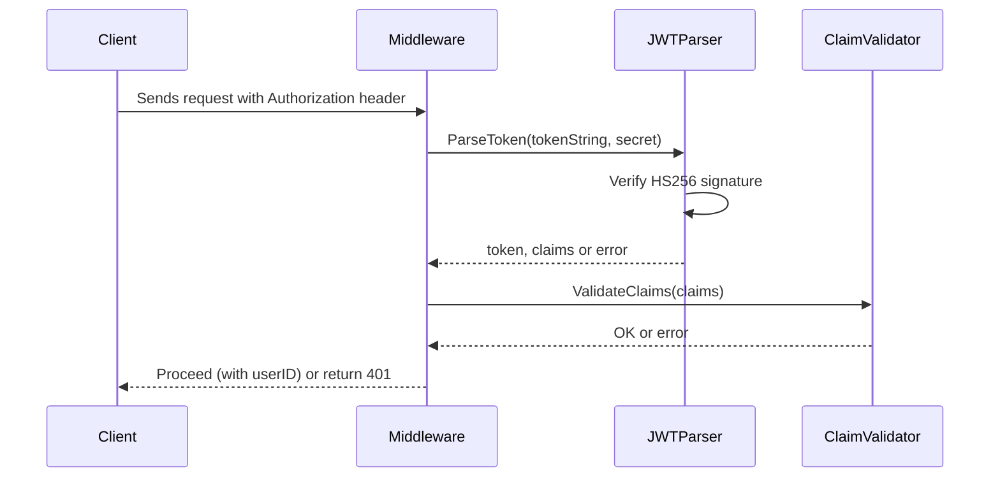
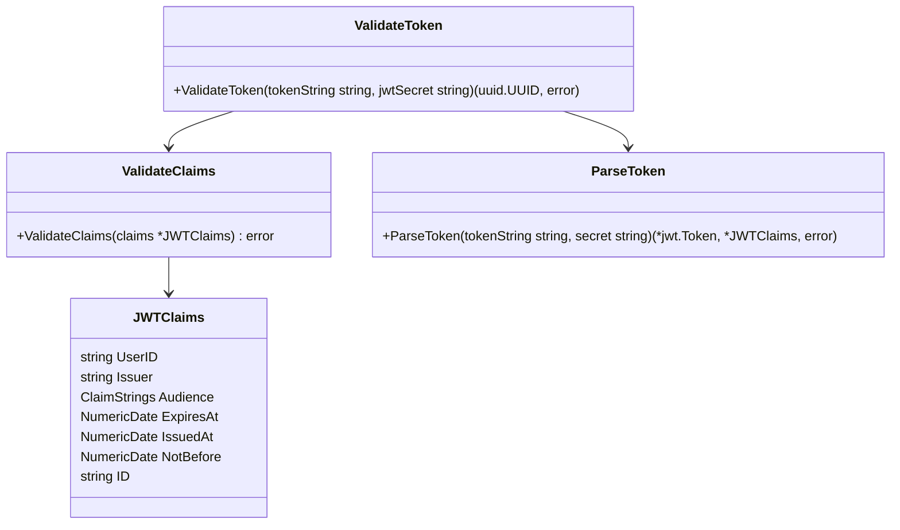

# JWT Validation Module Documentation

This document provides a full explanation of the JWT parsing and
validation pipeline implemented in your Go project. It is written for
developers who may not be experts in Golang or JWT internals.

---

## Overview

This module performs **cryptographic signature verification**, **claim
validation**, and **optional revocation checks** for JWT tokens. It is
intended for production use in authentication middleware.

### Responsibilities

1.  Parse JWT using a predefined claims structure.
2.  Validate the signature algorithm (HS256).
3.  Validate registered claims:
    - `exp` --- expiration time\
    - `iat` --- issued-at time\
    - `nbf` --- not-before time\
4.  Validate application-level claims:
    - Issuer (`iss`)
    - Audience (`aud`)
    - User ID (UUID)
5.  Return a valid `uuid.UUID` for use in handlers.

---

## Code Structure

### `ValidateClaims`

This function examines the logical correctness of claims.\
It verifies:

- **Expiration (`exp`)**\
  Ensures the token has not expired.

- **Issued At (`iat`)**\
  Ensures the token is not issued in the future.

- **Not Before (`nbf`)**\
  Ensures the token is not being used too early.

- **Issuer (`iss`)**\
  Must match `ExpectedIssuer`.

- **Audience (`aud`)**\
  Must contain at least one expected audience value.

- **User ID (custom claim)**\
  Must be a valid UUID string.

If any condition fails, a descriptive error is returned.

---

### `ValidateToken`

Coordinates:

1.  Token parsing (`ParseToken`)
2.  Signature validation
3.  Claim validation (`ValidateClaims`)
4.  Returns `uuid.UUID`

This is the function you call from middleware.

---

## Sequence Diagram (Token Validation Pipeline)

---

## UML Diagram --- Validation Component Architecture

---

## Best Practices

- Store `JWT_SECRET` in environment variables.
- Rotate secrets periodically.
- Implement a **revocation store** (Redis) if you rely on JTI.
- Minimize JWT lifetime for improved security.

---

## Example Folder Structure

    internal/
        jwt/
            parse.go
            validate.go
            errors.go
        schemas/
            jwt_claims.go

---

## Appendix: What Is a JWT?

A **JSON Web Token** is a cryptographically signed token that encodes:

1.  Header (algorithm, type)
2.  Claims (standard + custom)
3.  Signature (MAC or RSA/EC signature)

Your code uses **HMAC-SHA256**, which requires all services to share the
same secret.

---

## Contact

This README is auto-generated. Extend it as needed for your project.
