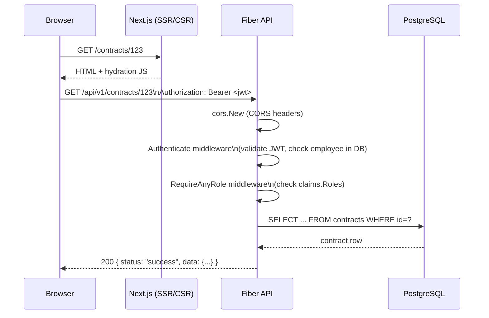

# Architecture

---

## System Overview

```
Browser (Next.js SPA)
        │
        │  HTTPS  Bearer JWT
        ▼
┌─────────────────────────────────┐
│    Reverse Proxy (Nginx/Caddy)  │
│  /api/*  →  :5000               │
│  /*      →  :3000               │
└──────────┬──────────────────────┘
           │
    ┌──────▼──────┐      ┌─────────────────────────┐
    │ Fiber v2    │      │ Filesystem               │
    │ Go 1.24 API │─────▶│ storage/contracts/<id>/  │
    │   :5000     │      │ (uploaded attachments)   │
    └──────┬──────┘      └─────────────────────────┘
           │ GORM / pgx/v5
    ┌──────▼──────┐
    │ PostgreSQL  │
    │   :5432     │
    └─────────────┘
```

---

## Request Lifecycle



---

## Backend Layer Separation

```
Handler (handlers/*_handler.go)
  │  Parses HTTP params/body, calls service, maps errors to HTTP status
  │  No DB access. No business logic.
  ▼
Service (services/*_service.go)
  │  Validates business rules, orchestrates DB operations, calls model methods
  │  e.g. StatementService.SetWorksDone → applies contract_coefficient → calls Recompute → saves
  ▼
GORM Model (models/*.go)
  │  Struct definition + domain methods (Recompute, HasRole, FullName, BeforeCreate)
  ▼
PostgreSQL (database/postgre.go)
  │  Connection pool: 10 idle / 100 open / 1h max lifetime
  └  pgx/v5 driver via gorm/driver/postgres
```

Dependency injection is constructor-based: each handler receives a `*gorm.DB` and constructs its service inline:

```go
// main.go
contractHandler := handlers.NewContractHandler(db)
// handlers/contracts_handler.go
func NewContractHandler(db *gorm.DB) *ContractHandler {
    return &ContractHandler{svc: services.NewContractService(db)}
}
```

No DI framework — `main.go` is the composition root.

---

## Authentication & Authorization

```
POST /api/v1/users/auth/signin
  → bcrypt.CompareHashAndPassword
  → jwt.NewWithClaims (HS256, JWTClaims{UserID, CompanyID, Roles, ...})
  → returns { token, user }

Every protected route:
  → Authenticate middleware
      ├─ Extract Bearer token from Authorization header
      ├─ jwtUtil.ValidateToken (signature + expiry)
      └─ SELECT EXISTS(... employees WHERE id=?) — rejects stale sessions
  → RequireAnyRole / SuperAdminOnly middleware
      └─ checks claims.Roles ⊇ required roles

Client storage:
  token → Zustand store (persisted to localStorage key "auth")
          + mirrored to SameSite=Lax cookie "auth_token" (for future SSR middleware)
```

`sudoer` role bypasses all role checks (`RequireAnyRole` short-circuits on `sudoer` or `admin`). `sudoer` is only granted to the bootstrap account and cannot be assigned through the normal employee update flow.

---

## Multi-Tenancy

Every operational entity (`Project`, `Contract`, `InterimStatement`, `Attachment`, etc.) carries a `CompanyID` that scopes it to a tenant. Services filter by `CompanyID` extracted from the JWT claims.

`Company` is self-referential via `ParentID` (nullable), enabling subsidiary hierarchies. `RootCompanyID` tracks the top-level tenant so cross-subsidiary queries can be scoped without recursive tree walks.

Department heads (`EngineeringHeadID`, `FinancialHeadID`, `JuridicalHeadID`, `SecurityHeadID`) are nullable FK columns on `Company` pointing to `Employee`. These are used to drive the contract approval workflow — each review stage requires the relevant department head to approve.

---

## Database Migrations

GORM's `AutoMigrate` is used, but with a deliberate layered approach:

```
model.AutoMigrate(db)
  └── 1. gorm.AutoMigrate per model (table creation / column addition)
         DisableForeignKeyConstraintWhenMigrating: true
         → GORM does NOT create FK constraints; we manage them explicitly.
  └── 2. MigrateForeignKeys(db)
         Reads GORM relationship metadata, generates ADD CONSTRAINT IF NOT EXISTS DDL.
         Idempotent via: SELECT 1 FROM pg_constraint WHERE conname = '...'
  └── 3. MigrateIndexes(db)
         Runs raw DDL for PG-specific features not expressible in struct tags:
         - GIN indexes on text[] columns (employees.roles, projects.tags)
         - Composite partial unique indexes (contracts.company_id + contract_no WHERE deleted_at IS NULL)
         - ALTER COLUMN DROP NOT NULL for nullable legacy columns
         All statements use IF NOT EXISTS / IF EXISTS guards.
```

`RESET_DB=true` executes `DROP SCHEMA public CASCADE; CREATE SCHEMA public` before migration — development only.

Primary keys are UUID v7 (time-ordered) generated in the `BeforeCreate` hook on `BaseModel`. UUID v7 sorts chronologically as a string, enabling `ORDER BY id` as a tiebreaker without a separate sequence.

---

## Financial Precision

All monetary amounts use `github.com/shopspring/decimal` (`NUMERIC(20,8)` in PostgreSQL). Basis points (bps) represent percentages as integers: `1000 bps = 10.00%`. This avoids floating-point drift in `10.0 / 100.0` style calculations.

The `InterimStatement.Recompute()` method is the **single source of truth** for all aggregate financial fields. It is called by the service layer after every mutation to `WorkDoneItem`, `ExtraWorkItem`, or `StatementDeductionItem`, and the result is persisted in a single `db.Save(&stmt)` call. There is no background job or trigger recomputing these values — they are computed in-process and cached on the statement row.

---

## File Storage

Attachments are stored on the local filesystem under `STORAGE_ROOT` (default `../storage`). The path structure is:

```
storage/
└── contracts/
    └── <contract-uuid>/
        └── <original-filename>
```

The API serves the directory as a static route at `/files-storage`. The `Attachment.StorageKey` field stores the relative path within `STORAGE_ROOT`; `Attachment.URL` is computed at query time (`BASE_URL + /files-storage/ + StorageKey`).

There is no CDN or object storage integration. For production deployments with high attachment volume, mount an NFS share or object store at `STORAGE_ROOT` and configure the API with a public `BASE_URL` that points to a CDN endpoint serving that storage.

---

## Report Generation

Excel statement reports are generated server-side using `github.com/xuri/excelize/v2`. The `ReportService.Build` method loads the statement with all child items via GORM `Preload`, formats them into the official Iranian صورت وضعیت spreadsheet format, and streams the workbook bytes to the client. There is no background queue — reports are generated synchronously on demand.

Filename format: `statement-<contract_no>-<sequence>-<jalali_date>.xlsx`

---

## Why Fiber?

| Criterion | Fiber v2 | net/http + chi |
|-----------|----------|----------------|
| Performance | fasthttp (zero-alloc HTTP parser) | stdlib allocations |
| Middleware API | Express-like, minimal boilerplate | Explicit handler chaining |
| Body limit config | Single `BodyLimit` field | Manual middleware |
| Static files | `app.Static()` built-in | Separate package |
| JSON binding | `c.BodyParser(&req)` | `json.NewDecoder(r.Body)` |

The 50 MB body limit (`defaultBodyLimitMB = 50`) in `main.go` covers the largest expected attachment (scanned A3 drawings). Fiber's fasthttp core means the limit is enforced before the request body is fully read, avoiding memory pressure on malformed large uploads.

---

## Data Flow: Statement Creation → Approval

```mermaid
flowchart TD
    A[POST /contracts/:id/statements] --> B[StatementService.Create]
    B --> C[InterimStatement row\nstatus=draft]

    C --> D[PUT /statements/:id/works-done]
    D --> E[SetWorksDone\napply contract_coefficient\nfor unit_rate]
    E --> F[Recompute\nGrossAmount ExtraAmount\nRetention Advance VAT LD Net]
    F --> G[db.Save &stmt]

    G --> H[PATCH /statements/:id/transition\nbody:{status:submitted}]
    H --> I[Transition: draft→submitted\nwrite ApprovalEvent]

    I --> J[finance_review → pm_review\n→ director_review → approved]
    J --> K[FxRate locked at approval time]
```
