# Database Schema

PostgreSQL 15+. All tables use UUID v7 primary keys (time-ordered). Soft delete via `deleted_at` on `BaseModel`. Financial amounts: `NUMERIC(20,8)` backed by `shopspring/decimal`.

---

## ER Diagram

```mermaid
erDiagram
    COMPANIES {
        uuid id PK
        string name
        string reg_num UK
        string country_code
        string tax_id UK
        bool is_active
        uuid parent_id FK
        uuid root_company_id FK
        uuid manager_id FK
        uuid engineering_head_id FK
        uuid financial_head_id FK
        uuid juridical_head_id FK
        uuid security_head_id FK
        timestamp created_at
        timestamp updated_at
        timestamp deleted_at
    }

    EMPLOYEES {
        uuid id PK
        uuid company_id FK
        string national_id UK
        string first_name
        string last_name
        string email UK
        string department
        string position
        numeric base_salary
        string salary_currency
        string employment_type
        text[] roles
        bool is_head
        bool active
        bytea password_hash
        timestamp hired_at
        timestamp terminated_at
        timestamp created_at
        timestamp updated_at
        timestamp deleted_at
    }

    PROJECTS {
        uuid id PK
        uuid company_id FK
        string code UK
        string name
        string status
        string priority
        string category
        numeric budget_estimate
        numeric budget_actual
        string currency
        text[] tags
        timestamp start_date
        timestamp end_date
        timestamp created_at
        timestamp updated_at
        timestamp deleted_at
    }

    CONTRACTORS {
        uuid id PK
        uuid company_id FK
        string type
        string display_name
        string first_name
        string last_name
        string company_name
        string legal_name
        string tax_id UK
        string registration_no UK
        string national_id
        string default_currency
        jsonb bank_account
        jsonb contact
        float rating
        timestamp created_at
        timestamp updated_at
        timestamp deleted_at
    }

    CONSULTANTS {
        uuid id PK
        uuid company_id FK
        string name
        string legal_name
        string registration_no UK
        string tax_id UK
        string specialization
        string license_no
        timestamp license_expiry
        string default_currency
        jsonb contact
        float rating
        bool is_active
        timestamp created_at
        timestamp updated_at
        timestamp deleted_at
    }

    CONTRACTS {
        uuid id PK
        uuid company_id FK
        uuid project_id FK
        uuid contractor_id FK
        uuid employer_id FK
        uuid consultant_id FK
        string contract_no UK
        string title
        string type
        string status
        numeric gross_budget
        string currency
        int retention_pct_bps
        int advance_pct_bps
        int vat_pct_bps
        int social_security_pct_bps
        int performance_bond_pct_bps
        int management_fee_pct_bps
        numeric contract_coefficient
        string boq_version
        timestamp signed_at
        timestamp starts_on
        timestamp ends_on
        timestamp created_at
        timestamp updated_at
        timestamp deleted_at
    }

    CONTRACT_LINE_ITEMS {
        uuid id PK
        uuid contract_id FK
        int sort_order
        string description
        string unit
        numeric quantity
        numeric unit_rate
        numeric total_price
        timestamp created_at
        timestamp updated_at
        timestamp deleted_at
    }

    INTERIM_STATEMENTS {
        uuid id PK
        uuid company_id FK
        uuid contract_id FK
        int sequence_no UK
        timestamp period_start
        timestamp period_end
        timestamp issued_on
        string status
        string currency
        numeric gross_amount
        numeric extra_amount
        numeric deduction_amount
        numeric retention_amount
        numeric advance_recovered
        numeric vat_amount
        numeric social_security_amount
        numeric ld_amount
        numeric net_amount
        numeric prev_progress_pct
        numeric progress_pct
        numeric fx_rate
        timestamp fx_rate_date
        text notes
        timestamp created_at
        timestamp updated_at
        timestamp deleted_at
    }

    WORK_DONE_ITEMS {
        uuid id PK
        uuid statement_id FK
        uuid line_item_id FK
        int line_no UK
        string boq_item_code
        string description
        string unit_code
        numeric quantity
        numeric unit_price
        numeric amount
        timestamp created_at
        timestamp updated_at
        timestamp deleted_at
    }

    EXTRA_WORK_ITEMS {
        uuid id PK
        uuid statement_id FK
        int line_no
        string description
        string unit
        numeric quantity
        numeric unit_price
        numeric amount
        string reason
        string variation_ref
        bool approved_by_client
        string approval_ref
        timestamp created_at
        timestamp updated_at
        timestamp deleted_at
    }

    STATEMENT_DEDUCTION_ITEMS {
        uuid id PK
        uuid statement_id FK
        int line_no
        string description
        string unit
        numeric quantity
        numeric unit_price
        numeric amount
        timestamp created_at
        timestamp updated_at
        timestamp deleted_at
    }

    RETENTION_RECORDS {
        uuid id PK
        uuid interim_statement_id FK
        uuid contract_id FK
        string retention_type
        int pct_bps
        numeric deducted_amount
        numeric released_amount
        string currency_code
        timestamp release_date
        text notes
        timestamp created_at
        timestamp updated_at
        timestamp deleted_at
    }

    ADVANCE_PAYMENT_RECORDS {
        uuid id PK
        uuid contract_id FK
        uuid interim_statement_id FK
        string record_type
        numeric amount
        string currency_code
        int recovery_pct_bps
        numeric cumulative_recovered
        numeric outstanding_balance
        timestamp txn_date
        text notes
        timestamp created_at
        timestamp updated_at
        timestamp deleted_at
    }

    LIQUIDATED_DAMAGES {
        uuid id PK
        uuid interim_statement_id FK
        uuid contract_id FK
        string ld_type
        numeric rate_per_day
        int days_applied
        numeric amount
        string currency_code
        timestamp period_from
        timestamp period_to
        bool waived
        text waiver_reason
        uuid created_by_id FK
        timestamp created_at
        timestamp updated_at
        timestamp deleted_at
    }

    APPROVAL_EVENTS {
        uuid id PK
        string entity_type
        uuid entity_id
        uuid actor_id
        string from_status
        string to_status
        text comment
        timestamp created_at
    }

    ATTACHMENTS {
        uuid id PK
        uuid company_id FK
        string entity_type
        uuid entity_id
        string document_type
        string file_name
        string storage_key
        string mime_type
        int size_bytes
        uuid uploaded_by_id FK
        timestamp created_at
        timestamp updated_at
        timestamp deleted_at
    }

    REFRESH_TOKENS {
        uuid id PK
        uuid user_id FK
        string token_hash UK
        timestamp expires_at
        timestamp revoked_at
        timestamp created_at
        timestamp updated_at
        timestamp deleted_at
    }

    COMPANIES ||--o{ EMPLOYEES : "employs"
    COMPANIES ||--o{ PROJECTS : "owns"
    COMPANIES ||--o{ COMPANIES : "parent_of"
    COMPANIES }o--o| EMPLOYEES : "manager"
    PROJECTS ||--o{ CONTRACTS : "has"
    CONTRACTORS ||--o{ CONTRACTS : "on"
    CONSULTANTS }o--o{ CONTRACTS : "supervises"
    CONTRACTS ||--o{ CONTRACT_LINE_ITEMS : "has WBS"
    CONTRACTS ||--o{ INTERIM_STATEMENTS : "has"
    INTERIM_STATEMENTS ||--o{ WORK_DONE_ITEMS : "contains"
    INTERIM_STATEMENTS ||--o{ EXTRA_WORK_ITEMS : "contains"
    INTERIM_STATEMENTS ||--o{ STATEMENT_DEDUCTION_ITEMS : "contains"
    INTERIM_STATEMENTS ||--o{ RETENTION_RECORDS : "tracks"
    INTERIM_STATEMENTS ||--o{ LIQUIDATED_DAMAGES : "applies"
    CONTRACTS ||--o{ ADVANCE_PAYMENT_RECORDS : "tracks"
    CONTRACT_LINE_ITEMS ||--o{ WORK_DONE_ITEMS : "references"
    EMPLOYEES ||--o{ REFRESH_TOKENS : "has"
```



---

## Tables Reference

### `companies`

Self-referential tenant hierarchy. `parent_id = NULL` means root company. `root_company_id` caches the root for O(1) scoping queries.

| Column | Type | Notes |
|--------|------|-------|
| `id` | uuid | UUID v7, PK |
| `reg_num` | varchar(64) | Unique registration number |
| `tax_id` | varchar(64) | Nullable unique |
| `parent_id` | uuid | FK → companies (self-referential, SET NULL on delete) |
| `root_company_id` | uuid | FK → companies (SET NULL, no cascade cycle) |
| `manager_id` | uuid | FK → employees (constraint:false — avoids chicken-and-egg cycle) |
| `engineering_head_id` … | uuid | Same pattern |

**Indexes:** `idx_companies_reg` (unique), `idx_companies_tax` (unique), `idx_companies_manager` (unique), B-tree on `parent_id`, `root_company_id`, head ID columns.

### `employees`

One row per person who can authenticate. `password_hash` (bcrypt) present only for employees with login access. `roles` is a PostgreSQL `text[]`.

| Column | Type | Notes |
|--------|------|-------|
| `national_id` | varchar(32) | Unique (used as username alternative) |
| `email` | varchar(320) | Unique |
| `roles` | text[] | e.g. `{manager,finance_head}` |
| `employment_type` | varchar(16) | `official` \| `contractual` |

**Indexes:** unique on `national_id`, unique on `email`, GIN on `roles` (`idx_employees_roles_gin`) — enables `roles @> ARRAY['manager']` containment queries.

### `projects`

Owned by a company. `tags` is `text[]` with GIN index for `tags @> ARRAY['urgent']`.

| Column | Type | Notes |
|--------|------|-------|
| `code` | varchar(64) | Unique per company (composite index with `company_id`) |
| `status` | varchar(16) | `planning` \| `active` \| `on_hold` \| `completed` \| `cancelled` |
| `priority` | varchar(16) | `low` \| `medium` \| `high` \| `critical` |

**Indexes:** composite unique `(company_id, code)`, GIN on `tags` (`idx_projects_tags_gin`), partial composite `(company_id, status, priority) WHERE deleted_at IS NULL` (`idx_projects_status_priority`).

### `contractors`

External execution counterparties. `type = individual` → use `first_name + last_name`. `type = company` → use `company_name`. `display_name` is derived and stored for index performance. `bank_account` and `contact` are JSONB blobs with no schema enforcement.

**Indexes:** unique on `tax_id`, unique on `registration_no`, partial on `national_id` (non-empty values only).

### `contracts`

Core entity. Financial parameters stored as basis points (bps): `1000 = 10.00%`. `contract_coefficient` (NUMERIC(8,4)) is the competitive bid adjustment factor for unit-rate contracts.

| Column | Type | Notes |
|--------|------|-------|
| `contract_no` | varchar(64) | Unique per company — composite partial index with `company_id` WHERE `deleted_at IS NULL` |
| `type` | varchar(32) | 10 possible values (see enums) |
| `status` | varchar(32) | 10-stage workflow |
| `contract_coefficient` | numeric(8,4) | Default 1. Applied to WBS unit rates in `SetWorksDone`. |

**Indexes:** `idx_contracts_company_no` (unique composite `company_id + contract_no`, partial), B-tree on `status`, `project_id`, `contractor_id`.

**Contract types:**

| Value | Persian | Payment basis |
|-------|---------|--------------|
| `lump_sum` | مقطوع | Progress × contract total |
| `unit_rate` | فهرست‌بها | Qty × unit_price × contract_coefficient |
| `cost_plus` | امانی | Actual costs + management fee % |
| `time_material` | — | Legacy |
| `construction_management` | مدیریت پیمان | — |
| `design_bid_build` | طراحی-مناقصه-ساخت | — |
| `design_build` | طراحی-ساخت / EPC | — |
| `labor_only` | دستمزدی | — |
| `turnkey` | کلید در دست | — |
| `percentage` | درصدی | — |

**Contract status workflow:**

`draft` → `pending_engineering` → `pending_finance` → `pending_legal` → `pending_ceo` → `ready_to_print` → `signed` → `active` → `closed` / `cancelled`

### `contract_line_items`

Bill-of-Quantities (WBS) line items. `unit_rate` is the MPO schedule price before the `contract_coefficient` adjustment.

### `interim_statements`

Payment certificates. All aggregate columns (`gross_amount`, `net_amount`, etc.) are **cached** and recomputed by `Recompute()` whenever a child item is mutated. Never update these columns directly.

| Column | Type | Notes |
|--------|------|-------|
| `sequence_no` | int | Auto-incremented per contract, CHECK > 0 |
| `status` | varchar(20) | 7-stage workflow |
| `fx_rate` | numeric(20,8) | Locked at approval time |
| `progress_pct` | numeric(7,4) | Computed as `gross_total / contract.gross_budget × 100` |

**Indexes:** composite unique `(contract_id, sequence_no)`, partial composite `(contract_id, status, sequence_no DESC) WHERE deleted_at IS NULL` (`idx_statements_contract_status`).

**Statement status workflow:**

`draft` → `submitted` → `finance_review` → `pm_review` → `director_review` → `approved` / `rejected`

### `approval_events`

Immutable audit log. **No `BaseModel` embed, no soft delete.** One row per status transition on any approvable entity.

| Column | Type | Notes |
|--------|------|-------|
| `entity_type` | varchar(64) | `interim_statement` \| `contract` |
| `entity_id` | uuid | The entity being transitioned |
| `actor_id` | uuid | Employee who triggered the transition |

**Index:** `idx_approval_events_entity` on `(entity_type, entity_id, created_at DESC)`.

### `attachments`

Polymorphic file metadata. `entity_type + entity_id` point to any entity. `storage_key` is the relative filesystem path under `STORAGE_ROOT`. `url` is computed at query time (not persisted).

**Index:** `idx_approval_events_entity` (same pattern) on `entity_type + entity_id`.

### `refresh_tokens`

Stores SHA-256 hash of issued refresh tokens. The plaintext token is never persisted.

---

## GORM Hooks

| Model | Hook | Effect |
|-------|------|--------|
| `BaseModel` | `BeforeCreate` | Generates UUID v7 if `ID == uuid.Nil` |
| `ApprovalEvent` | `BeforeCreate` | Same UUID v7 generation (no `BaseModel` embed) |

No `BeforeUpdate` or `AfterSave` hooks. Aggregate recomputation is explicit in the service layer.

---

## Soft Delete

All models embedding `BaseModel` include `gorm.DeletedAt` (nullable timestamp). GORM automatically appends `WHERE deleted_at IS NULL` to all queries. Hard delete is not used anywhere in the application — `db.Delete(&model)` sets `deleted_at = now()`.

`ApprovalEvent` does **not** embed `BaseModel` and has no `deleted_at` — it is truly immutable.

---

## Enum Constraints

All string enum columns have a PostgreSQL `CHECK` constraint enforced at the DDL level (in addition to Go-level `Valid()` methods). Examples:

```sql
CHECK (type IN ('lump_sum','unit_rate','cost_plus','time_material','construction_management','design_bid_build','design_build','labor_only','turnkey','percentage'))
CHECK (status IN ('draft','pending_engineering','pending_finance','pending_legal','pending_ceo','ready_to_print','signed','active','closed','cancelled'))
CHECK (status IN ('draft','submitted','finance_review','pm_review','director_review','approved','rejected'))
```
